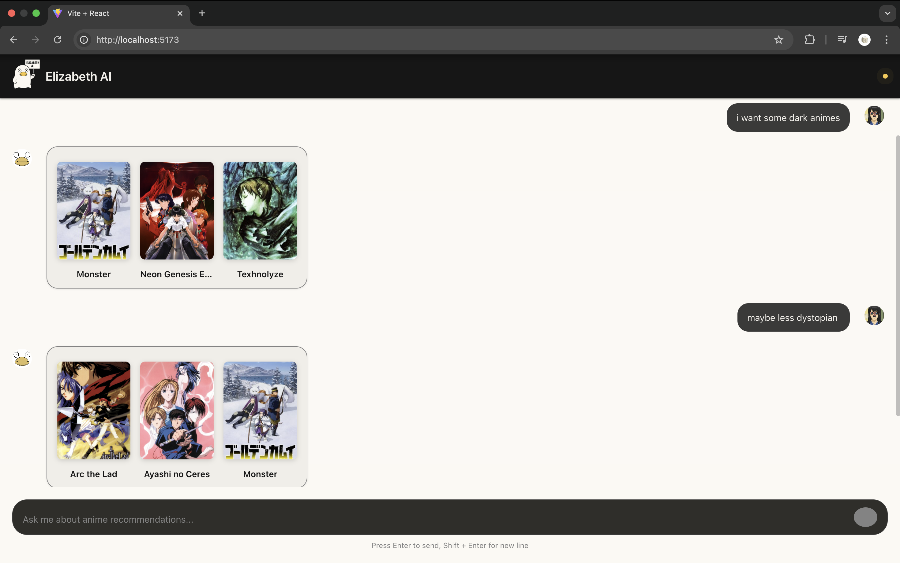
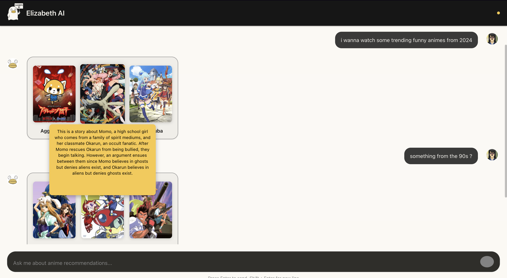

# Elizabeth AI - Anime Recommendation Agent


Elizabeth AI is a smart, conversational anime recommendation assistant that helps you discover anime you'll love based on your preferences — powered by large language models and enriched with AniList data.

> Inspired by Elizabeth from *Gintama* — cryptic on the outside, deeply insightful on the inside.

---

## 💡 Features

- 🎙️ **Conversational interface** — ask follow-up questions naturally  
- 🎯 **Refines recommendations** — based on your genre, tone, characters, or art-style preferences  
- 🔍 **Uses AniList API** — for accurate anime metadata, ratings, and tags  
- 🧠 **Context-aware responses** — considers previous conversation history for better suggestions  
- ✨ **Customizable output format** — clear, ranked, and formatted anime suggestions

---

## 🛠️ Tech Stack

- **Frontend**: React.js  
- **Backend**: Flask (Python)  
- **AI Model**: OpenAI GPT-4o-mini (via OpenAI SDK)  
- **External API**: AniList GraphQL and Linkup Websearch
- **Agent Framework**: OpenAI Agents SDK  

---


## Examples 




## 🚀 How to Run Locally

1. **Clone the Repo**
   ```bash
   git clone https://github.com/guhan-tofu/AI-Anime-Rec.git
   cd Elizabeth-AI

   # For backend
   cd flask-server
   python main.py

   # For frontend
   cd client
   npm run dev
